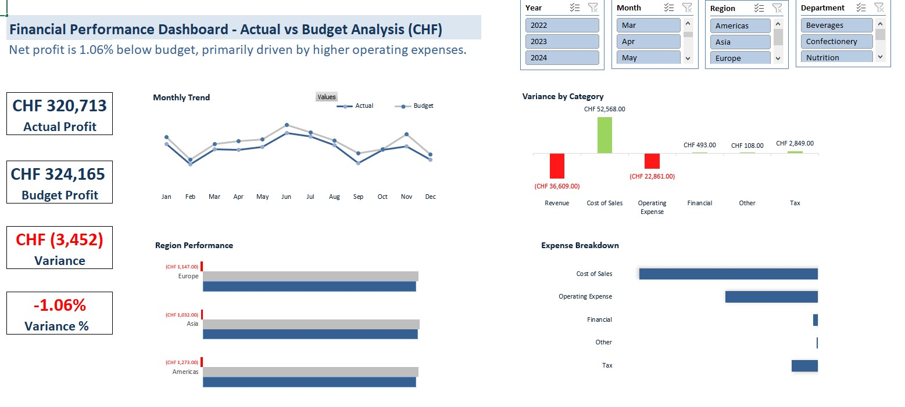

# 📊 Financial Performance Dashboard – Actual vs Budget Analysis (Excel)

## Overview

This project presents an interactive **Financial Performance Dashboard** built in **Microsoft Excel** to analyze **Actual vs Budget performance** across regions, departments, and financial categories.

The dashboard provides a clear view of financial performance by highlighting **profitability trends, cost drivers, and budget variances**. It enables decision-makers to quickly identify performance gaps and understand the factors impacting overall financial results.

---

## Key Features

* Data cleaning and transformation using **Power Query**
* Structured financial dataset using **Excel Tables**
* Account-to-category mapping using **XLOOKUP**
* **Pivot Table-based Profit & Loss (P&L) analysis**
* Calculation of **Variance** and **Variance %**
* Interactive filtering using **Slicers** (Year, Month, Region, Department)
* Data visualizations for trend analysis and cost breakdown

---

## Project Structure

```
financial-performance-dashboard-excel
│
├── Dashboard.xlsx
├── data
│   └── raw_financial_data.xlsx
├── images
│   └── dashboard_preview.png
└── README.md
```

---

## Dashboard Visualizations

The dashboard includes several visual components designed to support financial analysis:

* **KPI Cards**

  * Actual Profit
  * Budget Profit
  * Variance
  * Variance %

* **Monthly Trend**

  * Actual vs Budget performance over time

* **Variance by Category**

  * Highlights key drivers of financial variance

* **Expense Breakdown**

  * Shows distribution of major expense categories

* **Region Performance**

  * Compares financial performance across geographic regions

---

## Tools & Technologies

* **Microsoft Excel**
* **Power Query**
* **Pivot Tables**
* **XLOOKUP**
* **Data Visualization**

---

## Dashboard Preview



---

## Project Structure

financial-performance-dashboard-excel
│
├── Dashboard.xlsx
├── data
│   └── raw_financial_data.xlsx
├── images
│   └── dashboard_preview.png
└── README.md

---

## Next Steps

The next phase of this project is to recreate the same dashboard using **Power BI** to demonstrate:

* Advanced **data modeling**
* **DAX-based calculations**
* Enhanced **interactive visualizations**
* Professional BI dashboard design
